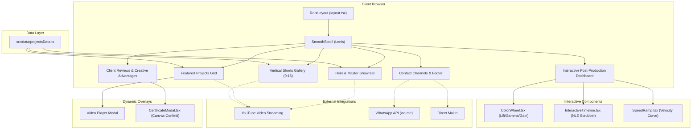

# 🎬 Rinku Dhakad — Premium Video Editor, Motion Designer & Colorist

> **"Editing Stories That People Can't Skip."**  
> A high-performance, cinematic portfolio web application engineered with **Next.js 16**, **React 19**, **Tailwind CSS 4**, and **Framer Motion 12**. Features interactive post-production simulators including a DaVinci Resolve 3-way color wheel, an NLE timeline scrubber, bezier speed ramp visualizers, and an immersive dark-room aesthetic with film grain overlay.

---

[](https://rinku-portfolio-nine.vercel.app)
[](https://nextjs.org/)
[](https://react.dev/)
[](https://www.typescriptlang.org/)
[](https://tailwindcss.com/)
[](https://www.framer.com/motion/)
[](https://lenis.darkroom.engineering/)
[](https://www.blackmagicdesign.com/products/davinciresolve)

---

## 🌐 Live Preview

Experience the portfolio live at: **[https://rinku-portfolio-nine.vercel.app](https://rinku-portfolio-nine.vercel.app)**

---

## 📖 Table of Contents

- [Overview](#-overview)
- [Key Features](#-key-features)
- [Interactive Post-Production Suite](#-interactive-post-production-suite)
- [Tech Stack](#-tech-stack)
- [System Architecture](#-system-architecture)
- [Project Structure](#-project-structure)
- [Prerequisites](#-prerequisites)
- [Getting Started & Installation](#-getting-started--installation)
- [Available Scripts](#-available-scripts)
- [Data Model & Customization](#-data-model--customization)
- [Deployment](#-deployment)
- [Showcased Projects](#-showcased-projects)
- [Author & Contact](#-author--contact)
- [License](#-license)

---

## 🎯 Overview

**Rinku Dhakad Portfolio** is a bespoke web experience crafted for **Rinku Dhakad**, a professional Video Editor, Motion Graphics Artist, and Colorist. The website bridges the gap between cinematic post-production craftsmanship and modern frontend engineering. 

Unlike conventional static portfolios, this application treats visitors to an authentic post-production studio atmosphere:
- **Cinematic Visual Language**: High-contrast dark room aesthetics (`bg-dark-950`), warm amber/gold accents (`#eab308`), and an active 35mm film-grain noise texture.
- **Interactive Studio Simulators**: Hands-on interactive widgets reproducing DaVinci Resolve grading wheels, timeline scrubbers, and bezier speed ramping curves.
- **Dynamic Content Showcase**: Seamless integration of 16:9 cinematic documentary showreels and 9:16 vertical short-form retention edits.
- **Flawless Motion**: Momentum scrolling driven by **Lenis** and buttery fluid micro-interactions with **Framer Motion 12**.

---

## 🚀 Key Features

### 🎥 Master Portfolio Reel
- Full-width cinematic documentary showcase featuring **"The Prime Classes | A Cinematic Documentary Edit"**.
- Built-in responsive YouTube integration with custom video framing, sound controls, and playback states.

### 📂 Featured Commercial & Narrative Edits
- Grid of long-form, commercial, and VFX projects with multi-tag filtering (e.g., *DaVinci Resolve*, *Fusion Compositing*, *Commercial*, *Storytelling*).
- Detailed technical breakdowns for each project: role, software utilized, core narrative arc, retention strategy, and sound design layers.

### 📱 Short-Form Vertical Video Gallery (9:16)
- Dedicated showcase of fast-paced vertical video reels engineered for TikTok, Instagram Reels, and YouTube Shorts.
- Demonstrates viral retention hooks, dynamic speed ramp curves, kinetic SaaS typography, and beat-synchronized cuts.

### 🎛️ Interactive Post-Production Dashboard
- Realistic hands-on simulations of industry-standard post-production controls (Color Wheels, Timeline, Speed Ramping).
- Fully responsive across desktop, tablet, and mobile displays.

### 📜 Certified Credentials Modal
- Modal dialog highlighting professional certifications (e.g., Blackmagic Design DaVinci Resolve Certified).
- Dynamic visual feedback featuring real-time confetti bursts using **Canvas Confetti**.

### 🌊 Inertial Momentum Smooth Scrolling
- Integrated **Lenis** smooth scrolling provider for a frictionless, weighted feel mimicking professional editing timelines.

### 💬 Client Testimonials & Value Matrix
- Verifiable client reviews highlighting dramatic retention improvements and fast turnaround workflows.
- Visual breakdown of creative strengths: *Fast Turnaround*, *Cinematic Quality*, *Attention to Detail*, *Strong Storytelling*, *Fusion Motion Graphics*, and *Brand-Focused Editing*.

### ⚡ One-Click Direct Inquiries
- Direct WhatsApp instant chat integration (`wa.me` deep link with pre-filled message).
- Quick email links, direct telephone dialing, and verified social media links (LinkedIn, Instagram).

---

## 🎛️ Interactive Post-Production Suite

The portfolio includes three custom-engineered interactive widgets that mirror non-linear editing (NLE) and color-grading workflows:

```
┌─────────────────────────────────────────────────────────────────────────┐
│                    POST-PRODUCTION STUDIO MODULES                       │
├─────────────────────────┬───────────────────────┬───────────────────────┤
│    🎨 Color Wheel       │ ⏱️ Interactive        │  📈 Dynamic Speed     │
│       Simulator         │    Timeline           │     Ramp Visualizer   │
├─────────────────────────┼───────────────────────┼───────────────────────┤
│ • 3-Way Color Wheels    │ • Multi-track scrubber│ • Bezier velocity     │
│   (Lift / Gamma / Gain) │ • Playhead tracking   │   curves              │
│ • Draggable color pucks │ • Audio/Video stems   │ • Acceleration vs.    │
│ • Live RGB tint balance │ • Real-time playback  │   deceleration nodes  │
│ • Double-click to reset │ • Cut & splice points │ • Frame remapping     │
└─────────────────────────┴───────────────────────┴───────────────────────┘
```

1. **DaVinci Color Wheel Simulator (`ColorWheel.tsx`)**:
   - Reproduces 3-way color grading controls (Lift, Gamma, Gain).
   - Draggable puck inside a polar color circle calculates real-time angle, saturation, and RGB tint vectors.
   - Includes double-click reset and live visual feedback.

2. **Interactive NLE Timeline (`InteractiveTimeline.tsx`)**:
   - Recreates a video editor's workspace complete with timecode counter (`00:00:00:00`), playhead scrubber, video tracks (V1, V2), and multi-layer audio stems (A1 dialogue, A2 SFX, A3 music).
   - Scrubbing and playhead dragging allows visitors to inspect edit cuts and pacing markers interactively.

3. **Speed Ramp Curve Visualizer (`SpeedRamp.tsx`)**:
   - Interactive bezier curve visualizer illustrating velocity time-remapping curves.
   - Highlights how high-energy edits transition from 100% real-time to 400% acceleration and 20% slow-motion impact pauses.

---

## 🛠️ Tech Stack

| Category | Technology | Version | Description |
|---|---|---|---|
| **Framework** | [Next.js](https://nextjs.org/) | `16.2.9` | App Router, Server/Client components, optimized font loading |
| **Library** | [React](https://react.dev/) | `19.2.4` | Modern React with advanced hook architecture |
| **Language** | [TypeScript](https://www.typescriptlang.org/) | `^5.0.0` | Strict type safety across components and data definitions |
| **Styling** | [Tailwind CSS](https://tailwindcss.com/) | `^4.0.0` | Next-generation utility-first styling with `@tailwindcss/postcss` |
| **Motion** | [Framer Motion](https://www.framer.com/motion/) | `^12.41.0` | Layout transitions, spring physics, scroll triggers, gesture controls |
| **Smooth Scroll** | [Lenis](https://lenis.darkroom.engineering/) | `^1.3.23` | High-performance momentum scrolling engine |
| **FX & Confetti** | [Canvas Confetti](https://www.npmjs.com/package/canvas-confetti) | `^1.9.4` | Canvas-based celebratory particle explosions |
| **Icons** | [Lucide React](https://lucide.dev/) | `^1.21.0` | Crisp, scalable SVG UI icons |
| **Typography** | [Google Fonts](https://fonts.google.com/) | Next Font | Inter (Body / Sans) & Outfit (Display / Headings) |
| **Linter** | [ESLint](https://eslint.org/) | `^9.0.0` | Code quality and Next.js recommended linting rules |
| **Deployment** | [Vercel](https://vercel.com/) | Cloud | Edge CDN distribution with automated continuous deployment |

---

## 🏗️ System Architecture



---

## 📂 Project Structure

```
rinku-portfolio/
├── public/                      # Static assets & SVG vector icons
│   ├── file.svg
│   ├── globe.svg
│   ├── next.svg
│   ├── vercel.svg
│   └── window.svg
├── src/
│   ├── app/
│   │   ├── favicon.ico          # Application favicon
│   │   ├── globals.css          # Tailwind CSS v4 directives, film grain noise & custom utilities
│   │   ├── layout.tsx           # Global HTML wrapper, Inter/Outfit Google fonts, Lenis container
│   │   └── page.tsx             # Main landing page assembling all sections & interactive tools
│   ├── components/
│   │   ├── CertificateModal.tsx # Certification popup with celebratory confetti animation
│   │   ├── ColorWheel.tsx       # Interactive 3-way color grading wheel (Lift/Gamma/Gain)
│   │   ├── InteractiveTimeline.tsx # Interactive NLE timeline with playhead & audio/video stems
│   │   ├── SmoothScroll.tsx     # Momentum scrolling wrapper powered by @studio-freight/lenis
│   │   └── SpeedRamp.tsx        # Interactive bezier curve visualizer for speed ramping
│   └── data/
│       └── projectsData.ts      # Structured data store for showreel, featured edits & 9:16 reels
├── eslint.config.mjs            # ESLint flat config
├── next.config.ts               # Next.js configuration
├── package.json                 # Project dependencies, scripts & metadata
├── postcss.config.mjs           # PostCSS plugin pipeline for Tailwind CSS v4
└── tsconfig.json                # TypeScript compiler configuration
```

---

## 📋 Prerequisites

Before running the application locally, ensure your environment meets the following requirements:

- **Node.js**: `v18.18.0` or higher (`v20.x` LTS recommended)
- **Package Manager**: `npm` (`v9+`), `pnpm` (`v8+`), `yarn` (`v1.22+`), or `bun`

Verify your Node.js and npm installations:
```bash
node -v
npm -v
```

---

## ⚙️ Getting Started & Installation

### 1. Clone the Repository
```bash
git clone https://github.com/Happybhai329/rinku-portfolio.git
cd rinku-portfolio
```

### 2. Install Dependencies
Install the required packages using your preferred package manager:

```bash
# Using npm
npm install

# Or using pnpm
pnpm install

# Or using yarn
yarn install

# Or using bun
bun install
```

### 3. Start the Development Server
```bash
npm run dev
```

The application will start on **`http://localhost:3000`**. Open this URL in your web browser to explore the portfolio.

---

## 🏃 Available Scripts

The following scripts are defined in `package.json`:

| Command | Action | Description |
|---|---|---|
| `npm run dev` | `next dev` | Starts the Next.js development server with hot-module reloading |
| `npm run build` | `next build --webpack` | Compiles the production build using Webpack |
| `npm run start` | `next start` | Runs the compiled production build locally |
| `npm run lint` | `eslint` | Runs ESLint 9 checks across all TypeScript and React source files |

---

## 🔧 Data Model & Customization

All portfolio projects, video URLs, categories, and technical tags are organized inside [`src/data/projectsData.ts`](src/data/projectsData.ts).

### Project Interface
```typescript
export interface Project {
  id: string;
  title: string;
  role: string;
  software: string;
  description: string;
  highlights: string[];
  youtubeId: string;
  youtubeUrl: string;
  aspectRatio: "16:9" | "9:16";
  tags: string[];
}
```

### Adding or Modifying Projects
To add a new project, open `src/data/projectsData.ts` and append an entry to `featuredProjects` or `shortsGallery`:

```typescript
export const featuredProjects: Project[] = [
  {
    id: "project-new",
    title: "Cinematic Commercial Ad",
    role: "Lead Video Editor & Colorist",
    software: "DaVinci Resolve Studio",
    description: "High-impact commercial edit with narrative pacing and custom grade.",
    highlights: [
      "Dynamic speed ramping",
      "Multi-layered sound design",
      "Custom Fusion title animations"
    ],
    youtubeId: "<YOUTUBE_ID>",
    youtubeUrl: "https://www.youtube.com/watch?v=<YOUTUBE_ID>",
    aspectRatio: "16:9",
    tags: ["Commercial", "DaVinci Resolve", "Color Grading"]
  }
];
```

---

## 🚀 Deployment

The portfolio is pre-configured for seamless deployment to **Vercel**:

### Deploy via Vercel CLI
```bash
npm install -g vercel
vercel
```

### Deploy via GitHub
1. Push your repository to GitHub.
2. Go to the [Vercel Dashboard](https://vercel.com/new).
3. Import the `Happybhai329/rinku-portfolio` repository.
4. Next.js will be detected automatically.
5. Click **Deploy**.

The live production deployment is hosted at:  
👉 **[https://rinku-portfolio-nine.vercel.app](https://rinku-portfolio-nine.vercel.app)**

---

## 🎥 Showcased Projects

| Project | Format | Software | Key Techniques |
|---|---|---|---|
| **The Prime Classes (Showreel)** | 16:9 Master Reel | DaVinci Resolve Studio | Color grading, narrative pacing, commercial storytelling, Fusion motion graphics |
| **High-Energy Short-Form Edit** | 9:16 Vertical Reel | DaVinci Resolve | Dynamic speed ramps, snappy typography, audio sync, retention hooks |
| **Long Form Storytelling Edit** | 16:9 Long Form | DaVinci Resolve | Story pacing, multi-track audio mix, explanatory motion graphics, scene grading |
| **The Prime Classes Campaign** | 16:9 Commercial | DaVinci Resolve | Commercial marketing structure, brand palette grading, CTA animations |
| **Fusion Cinematic Intro** | 16:9 Title Sequence | DaVinci Resolve Fusion | 3D title text extrusion, node-based VFX compositing, particle effects, glitch transitions |
| **SaaS Motion Graphics Reel** | 9:16 Travel Reel | Fusion & Resolve | Kinetic typography, SaaS-style clean transitions, sound design |
| **Editing Skool Masterclass** | 9:16 Educational | DaVinci Resolve | Workflow breakdowns, fast cuts, retention hooks |
| **Billie Hawkins High-Retention** | 9:16 Short Form | DaVinci Resolve | Frame-one hook strategy, zero drop-off pacing, polished sound cues |

---

## 🤝 Contributing

Contributions, issues, and feature requests are welcome!

1. Fork the repository
2. Create your feature branch (`git checkout -b feature/AmazingFeature`)
3. Commit your changes (`git commit -m 'Add some AmazingFeature'`)
4. Push to the branch (`git push origin feature/AmazingFeature`)
5. Open a Pull Request

---

## 👤 Author & Contact

**Rinku Dhakad**  
*Professional Video Editor, Motion Designer & Colorist*

- 🌐 **Portfolio Website**: [rinku-portfolio-nine.vercel.app](https://rinku-portfolio-nine.vercel.app)
- 💬 **WhatsApp**: [+91 62617 54675](https://wa.me/916261754675?text=Hi%20Rinku,%20I%20saw%20your%20portfolio%20and%20would%20like%20to%20discuss%20a%20video%20editing%20project!)
- 📞 **Phone**: [+91 62617 54675](tel:+916261754675)
- ✉️ **Email**: [its.rinkuverse@gmail.com](mailto:its.rinkuverse@gmail.com)
- 💼 **LinkedIn**: [Rinku Dhakad](https://www.linkedin.com/in/rinku-dhakad-97a55a403/)
- 📸 **Instagram**: [@rinku.dhakadd](https://www.instagram.com/rinku.dhakadd/)

**Web Platform Engineering**:
- **Happy Bhasin** ([@Happybhai329](https://github.com/Happybhai329)) — [bhasinhappy0506@gmail.com](mailto:bhasinhappy0506@gmail.com)

---

## 📄 License

This project and its original video assets are proprietary works created for **Rinku Dhakad**.  
All rights reserved © 2026.
